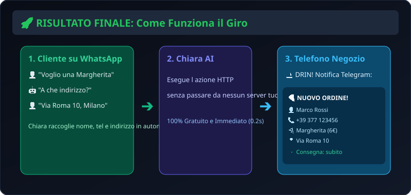
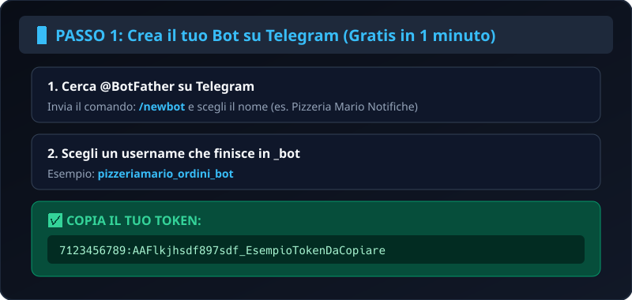
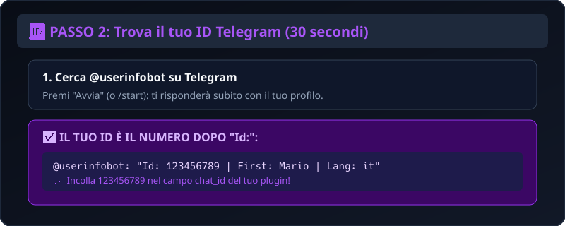
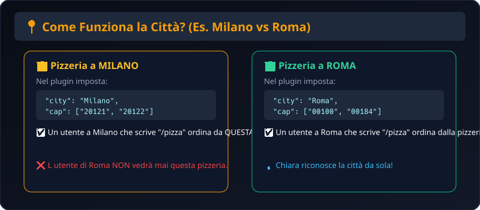

# 🍕 Guida Facilissima per le Aziende: Ricevi Ordini su WhatsApp (100% Gratis e Senza Server)

Hai una **pizzeria**, un **ristorante**, un **barbiere** o un **negozio**?  
Con questa guida puoi far ordinare o prenotare i tuoi clienti direttamente su WhatsApp con Chiara, e **ogni ordine ti squilla istantaneamente sul cellulare via Telegram**.

> 💡 **Zero costi, zero programmatori, zero siti web.** Ci vogliono solo 3 minuti di orologio.

---

## 📸 Come Funziona il Giro (Guarda lo Schema)



1. Il cliente scrive su WhatsApp a Chiara (es. *"Voglio una Margherita a domicilio"*).
2. Chiara gli mostra il tuo menu con i prezzi e gli chiede via e citofono.
3. **DRIN!** Il tuo telefono suona su Telegram con l ordine completo pronto per la cucina!

---

## 🛠️ Come Farlo in 3 Minuti (Passo-Passo "Terra Terra")

### 📱 PASSO 1: Crea il tuo Bot Gratuito su Telegram (1 minuto)



1. Apri Telegram e cerca **`@BotFather`** (ha la spunta blu).
2. Scrivi il comando: `/newbot`
3. Dagli un nome (es. *Mario Pizzeria Notifiche*) e un username che finisce in `_bot` (es. *mariopizzeria_ordini_bot*).
4. BotFather ti darà un codice lungo chiamato **Token** (es. `7123456789:AAF_xxxxxxxxxxxx`). **Copialo!**

---

### 🆔 PASSO 2: Scopri il tuo Numero ID (30 secondi)



1. Cerca su Telegram il bot **`@userinfobot`** e premi **Avvia**.
2. Ti risponderà mostrandoti il tuo **Id** (es. `123456789`). **Copialo!**

*(Se hai una pizzeria con più persone, puoi creare un gruppo Telegram con i tuoi pizzaioli, aggiungere il tuo bot al gruppo e usare l ID del gruppo).*

---

### 📝 PASSO 3: Prepara il tuo Menu (`plugin.json`)

Prendi questo testo, cambia le pizze con i tuoi prezzi e inserisci il tuo **Token** e il tuo **Chat ID**:

```json
{
  "schemaVersion": 1,
  "id": "pizzeria-mario-milano",
  "name": "Pizzeria da Mario",
  "description": "Menu e pizze a domicilio a Milano.",
  "category": "Food",
  "version": "1.0.0",
  "location": {
    "city": "Milano",
    "province": "MI",
    "cap": ["20121", "20122", "20123"]
  },
  "permissions": ["phone", "name"],
  "trigger": {
    "type": "command",
    "command": "/pizza"
  },
  "data": [
    { "key": "margherita", "nome": "Margherita", "prezzo": "6.00 €", "ingredienti": "Pomodoro, mozzarella, basilico" },
    { "key": "diavola", "nome": "Diavola", "prezzo": "7.50 €", "ingredienti": "Pomodoro, mozzarella, salame piccante" },
    { "key": "quattro formaggi", "nome": "4 Formaggi", "prezzo": "8.50 €", "ingredienti": "Mozzarella, gorgonzola, fontina, parmigiano" }
  ],
  "actions": [
    {
      "type": "ask",
      "variable": "scelta_pizza",
      "prompt": "🍕 *Pizzeria da Mario (Milano)* 🍕\nQuale pizza desideri ordinare?\n• *Margherita* (6.00 €)\n• *Diavola* (7.50 €)\n• *4 Formaggi* (8.50 €)"
    },
    {
      "type": "lookup",
      "key": "{{scelta_pizza}}",
      "template": "Hai scelto la pizza *{{nome}}* ({{prezzo}}).\n\nA quale indirizzo e civico desideri la consegna a domicilio?"
    },
    {
      "type": "ask",
      "variable": "indirizzo_consegna",
      "prompt": "Inserisci via, civico e citofono per il rider:"
    },
    {
      "type": "http",
      "url": "https://api.telegram.org/botIL_TUO_TOKEN_DI_TELEGRAM_QUI/sendMessage",
      "method": "POST",
      "body": {
        "chat_id": "IL_TUO_ID_NUMERICO_QUI",
        "text": "🍕 *NUOVO ORDINE DA CHIARA!*

👤 *Cliente:* {{user_name}}
📞 *Telefono:* {{phone}}
🍕 *Pizza:* {{scelta_pizza}}
📍 *Indirizzo:* {{indirizzo_consegna}}
🕒 *Orario:* Subito",
        "parse_mode": "Markdown"
      },
      "template": "✅ *Ordine confermato dalla Pizzeria da Mario!*
🍕 Pizza: {{scelta_pizza}}
📍 Consegna: {{indirizzo_consegna}}
🕒 Consegna stimata: 25-30 minuti.

Grazie {{user_name}}, ti contatteremo al {{phone}} per qualsiasi necessità!"
    }
  ]
}
```

---

## ❓ Domanda Frequente: Se una Pizzeria è a Milano e il Cliente è a Roma?



Niente paura, **Chiara gestisce la posizione geografica in automatico**:

1. **Il campo `"location"` nel plugin:**
   Ogni attività indica la propria città (es. `"city": "Milano"`) e i CAP coperti dal servizio di consegna a domicilio.
2. **Chiara conosce già la città dell utente:**
   * Chiara sa dove si trova l utente (dalla memoria o dal meteo).
   * Se un utente a **Milano** scrive `/pizza`, Chiara gli collega la pizzeria di **Milano**.
   * Se un utente a **Roma** scrive `/pizza`, Chiara gli collega la pizzeria di **Roma**.
3. **E se Chiara non sa ancora la città?**
   * Chiara chiede semplicemente: *"In quale città ti trovi per la consegna?"*.
   * Una volta che l utente dice ad esempio *"Milano"*, Chiara se lo ricorda per sempre e non glielo chiede mai più!

---

## 🚀 Come Pubblicare il Plugin su Chiara (Pronto all Uso)

1. Vai sul repository open-source: [**github.com/notsim/chiara-plugins**](https://github.com/notsim/chiara-plugins).
2. Carica la cartella con il tuo `plugin.json` dentro `plugins/nome-tua-pizzeria/`.
3. Non appena viene approvato, **tutti i clienti di Chiara nella tua città potranno iniziare ad ordinare da te su WhatsApp**!
